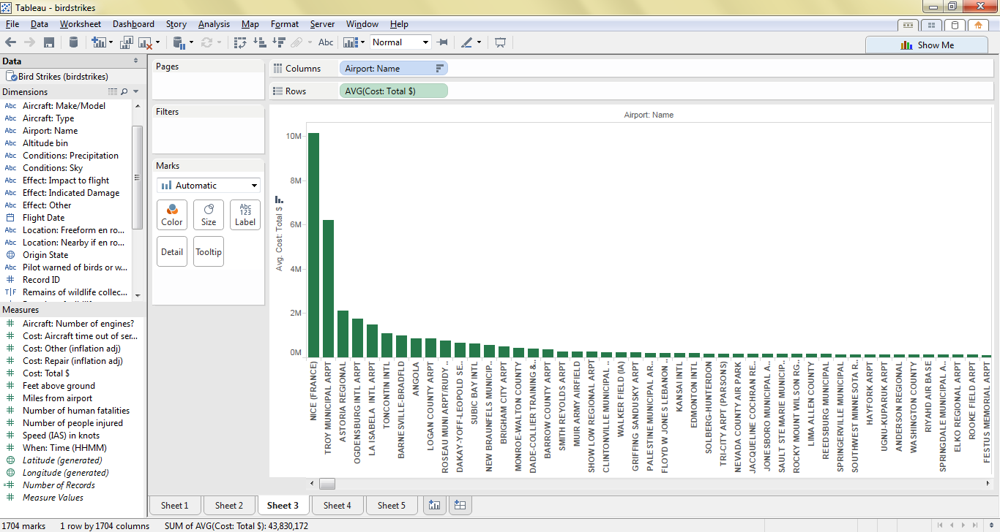
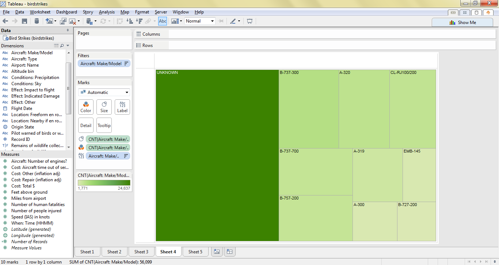

# Report

Using Tableau, create visualization for each question in the report regarding
bird strikes.

# Authors

This report is prepared by
* [Full name](link to github account)
* [Full name](link to github account)
* [Full name](link to github account)
* [Full name](link to github account)
* [Full name](link to github account)

# which airlines have worst luck with birdstrikes in terms of damage caused?

This question was asked by (calebhsu).

(write your explanation for the reader as to where to look at this chart in order
    to see the answer)

# what is the most common flight phase where a birdstrike occurred?

This question was asked by (kevinkgifford).

(write your explanation for the reader as to where to look at this chart in order
    to see the answer)

# what airports have most expensive average accident?

This question was asked by (satchelspencer).

(write your explanation for the reader as to where to look at this chart in order
    to see the answer)

# which plane strikes the most birds?

This question was asked by (twagar95).

(write your explanation for the reader as to where to look at this chart in order
    to see the answer)

# what state had the highest number of bird strikes?

This question was asked by (drewdinger).

(write your explanation for the reader as to where to look at this chart in order
    to see the answer)    
