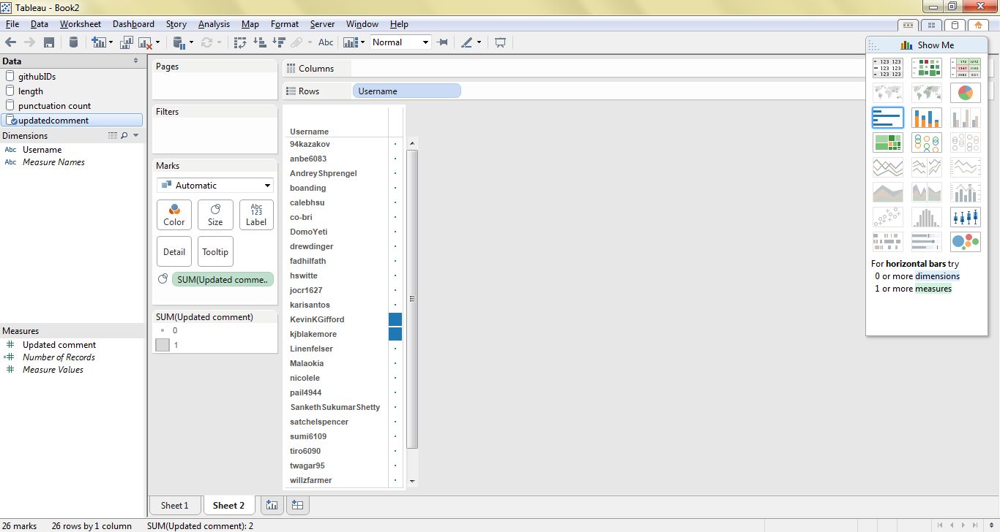

# Tableau Visualization

Tableau is arguably the biggest deal now in terms of data visualization for non-programmers.
Let's pretend you are not a programer. Learn and experience what it is like to make
visualizations using Tableau to answer the same questions about your classmates in our course.

For each of the question, think about what chart you should use to convey your answer and
make your best effort to create something that makes sense to you. There's no right
or wrong. When we meet in the class again, we will set aside time for each team to discuss
and compare the variety of visualization solutions each member has come up with for the
same set of questions. It will be fun!

To include a Tableau visualization in your report, take a screenshot, save it as an image,
put it in the `learning/week2` folder, and replace ``  with
your own image. Please makes sure your screenshot includes the _entire_ Tableau interface
including the controls, widgets ...etc.

# How big the deal Tableau really is?

According to an article from Forbes (http://www.forbes.com/sites/greatspeculations/2015/04/15/a-closer-look-at-tableaus-customer-base-growth/), Tableau's customer base grew nearly 6x in size from 2010 to 2014. Additionally, the customer base for analytics software is expected to continue growing very rapidly, further the demand for tools such as Tableau. 

# Who wrote the most for thier comment?

This is a visualization of the length of comments made by students. Each comment is represented by a vertical line on the graph. This visualization makes it easy to see the distribution of comment length made by various students. 

# Which student has been a member of GitHub the longest?

This is a visualization of each student's github userID. Each student is represented by a vertical line on the graph. Assuming that github userIDs are assigned sequentially, this is a visual representation of the time at which the students chose to adopt github. You can see that this class has a couple of relatively early github adopters, and that there are a couple of cases where student adoption of github more clustered.

# Who has updated their comment?

This visualization is a list of github usernames. The box to the right of each student's name is larger if they updated their comment.

# Who uses the most punctuation?

This visualizes the number of students who used a particular number of punctuation marks in their comment. The larger and darker the box, the more frequently that particular number of punctuation marks was used by students in the class. For example, the large, dark green box represents students who used 4 punctuation marks in their comment; the large size and dark color indicates that the vast majority of students in the class used exactly 4 punctuation marks in their comment.
